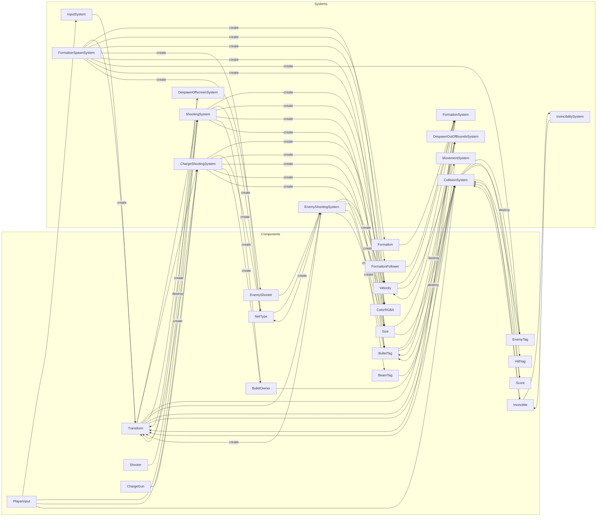

# ECS Graph — Components and Systems

This page provides a visual overview of the ECS relationships and the execution order.

## Tick order

1. InputSystem
2. ShootingSystem
3. ChargeShootingSystem
4. FormationSystem
5. MovementSystem
6. EnemyShootingSystem
7. DespawnOffscreenSystem
8. DespawnOutOfBoundsSystem
9. CollisionSystem
10. InvincibilitySystem
11. FormationSpawnSystem

## Systems ↔ Components dependency graph (Mermaid)

