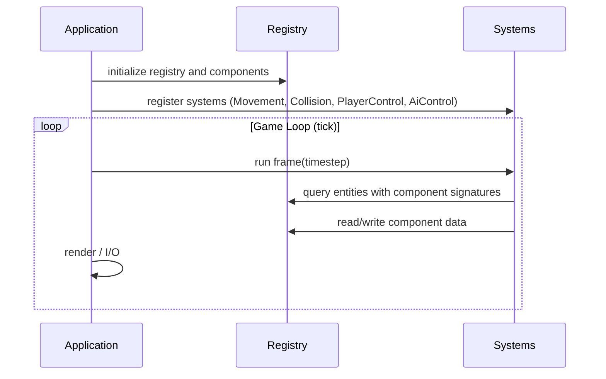
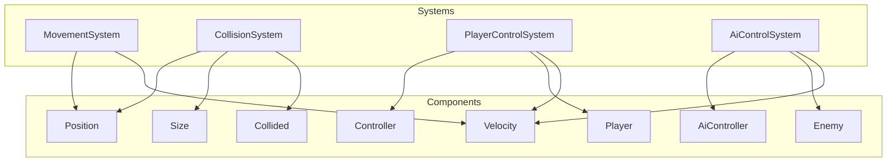

## Engine Overview

The engine uses an ECS (Entity-Component-System) model:

- Entities are lightweight IDs
- Components store pure data attached to entities
- Systems iterate entities matching required components and update state each frame

### Runtime lifecycle

### Component -> System relationships

