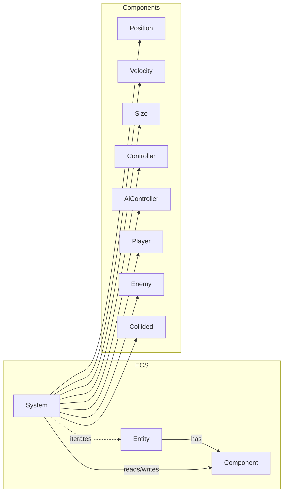

## Engine Documentation

This section documents the game engine architecture and its ECS (Entity-Component-System) runtime. It mirrors the structure of the protocol docs: a base overview and subfolders for components and systems.

- See `00-overview.md` for the high-level design and lifecycle
- See `components/` for individual component pages
- See `systems/` for individual system pages

