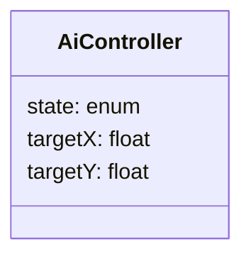

## AiController

Stores AI state or directives for autonomous entities.

```mermaid
classDiagram
  class AiController {
    state: enum
    targetX: float
    targetY: float
  }
```

Consumed by: `AiControlSystem`.

