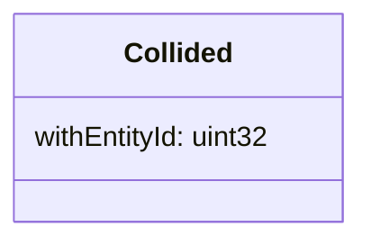

## Collided

Transient component indicating a collision occurred this frame, with a reference to the other entity.

```mermaid
classDiagram
  class Collided {
    withEntityId: uint32
  }
```

Produced by: `CollisionSystem`.

