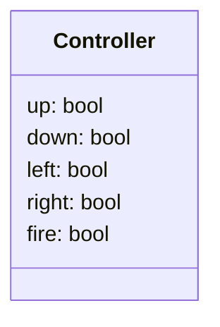

## Controller

Carries player input state for locally controlled entities.

```mermaid
classDiagram
  class Controller {
    up: bool
    down: bool
    left: bool
    right: bool
    fire: bool
  }
```

Consumed by: `PlayerControlSystem`.

