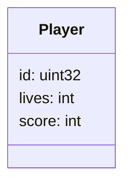

## Player

Marks an entity as a player-controlled actor and stores player metadata.

```mermaid
classDiagram
  class Player {
    id: uint32
    lives: int
    score: int
  }
```

Used by: `PlayerControlSystem`.

