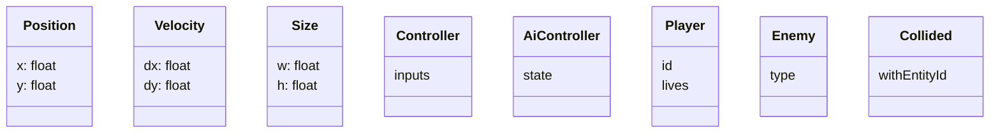

## Components

This folder documents each ECS component. Components are pure data; they do not contain behavior.

- `Position`
- `Velocity`
- `Size`
- `Controller`
- `AiController`
- `Player`
- `Enemy`
- `Collided`

