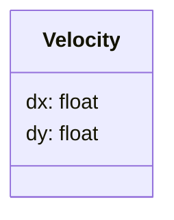

## Velocity

Represents an entity's movement per tick.

```mermaid
classDiagram
  class Velocity {
    dx: float
    dy: float
  }
```

Used by: `MovementSystem`, produced by `PlayerControlSystem` and `AiControlSystem`.

