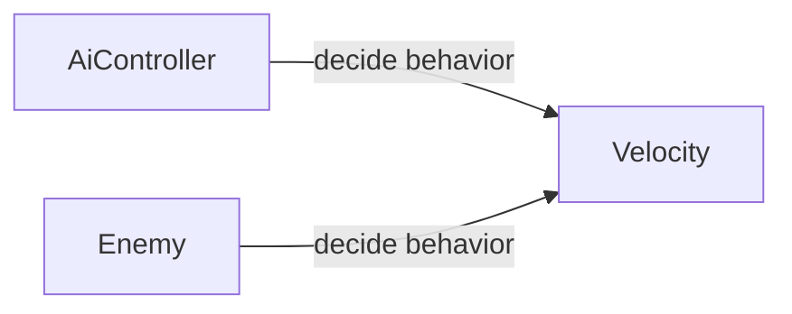

## AiControlSystem

Computes movement directives for `Enemy` entities from `AiController` state, updating `Velocity`.

```mermaid
flowchart LR
  AiController & Enemy -- decide behavior --> Velocity
```

Signature: requires `Enemy`, `AiController`. Writes `Velocity`.

