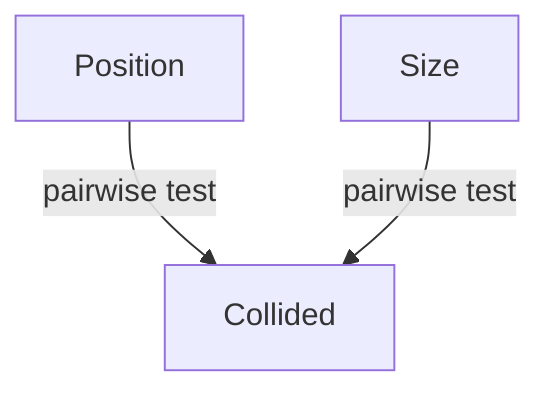

## CollisionSystem

Performs AABB tests between entities with `Position` and `Size`, emitting `Collided` on hits.

```mermaid
flowchart TB
  Position & Size -- pairwise test --> Collided
```

Signature: requires `Position`, `Size`. Produces `Collided`.

