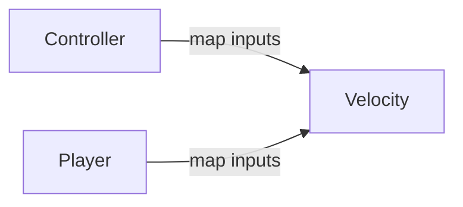

## PlayerControlSystem

Translates `Controller` input for `Player` entities into `Velocity` changes.

```mermaid
flowchart LR
  Controller & Player -- map inputs --> Velocity
```

Signature: requires `Player`, `Controller`. Writes `Velocity`.

