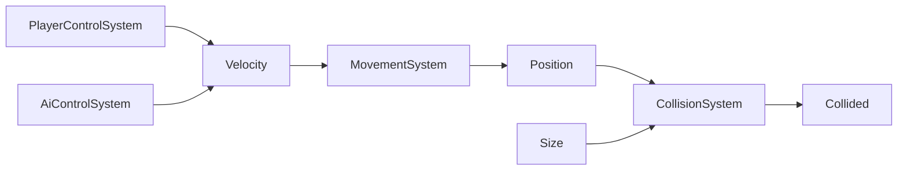

## Systems

This folder documents each ECS system. Systems iterate over entities with specific component signatures and update their data.

- `MovementSystem`
- `CollisionSystem`
- `PlayerControlSystem`
- `AiControlSystem`

